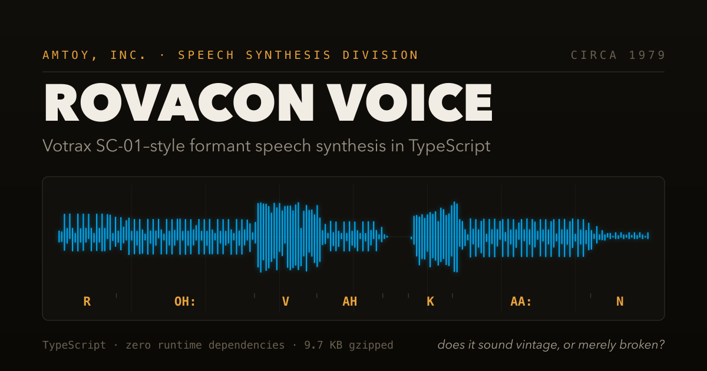

<p align="center">
  
</p>

<p align="center">
  <a href="LICENSE"></a>
  
  
  
  
  
</p>

# Rovacon Voice — Design Document & Tuning Bench

**Rovacon Voice is a zero-dependency TypeScript recreation of Votrax
SC-01-class formant speech synthesis — the chip behind Berzerk's "Intruder
alert!" — small enough to ship inside a game at 9.7 KB gzipped.** Type any
phrase into the browser tuning bench, hear it rendered as 1980 arcade speech
in real time, and export the result as WAV. The wrongness is generated, not
applied: quantized formants, a buzzy impulse-train glottis, and an 8 kHz
chip-rate ceiling — a real synthesizer, not a modern voice with filters on
top.

**Component of:** Rovacon (13-document design suite, Docs 00–12)
**Owning document:** Doc 10 — Audio Design, §3B
**Status:** TypeScript implementation complete and tested. Tuning bench
operational. **VQ-01 unresolved** — awaiting a listening judgment.

---

## 0. Purpose

This repository exists to answer one question:

> **Does runtime formant synthesis sound like a 1979 arcade cabinet, or does it
> just sound broken?**

That question is logged as **VQ-01** and it is the highest-uncertainty item in
the Rovacon project. Doc 12's risk register carries it as a Medium risk with
"prototype in week one of Phase 8" as the mitigation. This repo is that
prototype, brought forward so the answer arrives before the main build commits
to the approach.

The bench lets you type any word or phrase, move sliders, and hear the result
immediately. If the answer turns out to be "broken," the fallback is
pre-rendered clips using the same synthesizer — but that decision should be
made with ears, not assumptions.

---

## 1. Rovacon In One Page

For anyone landing here without the main suite.

Rovacon is a browser-based simulator of a fictional 1979 programmable toy rover
— a close model of the Milton Bradley **Big Trak**, with the serial numbers
filed off and a fictional manufacturer (**AmToy, Inc.**) invented around it.

**The game.** The player enters up to sixteen movement commands on a plastic
keypad — forward 4, right 15, forward 2, fire 1, out — then presses GO and
watches the vehicle execute them blind in a procedurally generated 1979
American house. There is no steering. There is no undo. Success requires
measurement, foresight, and an understanding that carpet eats about 4% of
forward travel.

**Units, from the original manual.** One distance unit is one vehicle length
(33 cm). One rotation unit is one clock minute (6°), so 15 is a right turn and
60 is a full circle. One time unit is a tenth of a second.

**The aesthetic.** Saturday-morning-cartoon toy commercial. Gaudy box art,
sunburst gradients, a deadpan operator's manual in 1979 corporate
British-inflected English, and a narrator who says *some assembly required* at
the end of a fifteen-second spot.

**Two sonic registers** (Doc 10 §1A):

- **Register A — Piezo.** The toy itself. Square waves under a hard 3.2 kHz
  lowpass. Key presses, motor, wheels, error tones.
- **Register B — Arcade.** The game layer around the toy. Full bandwidth,
  sawtooth and noise, resonant sweeps. Photon cannon, scoring, the high-score
  ledger — and the voice.

The voice is Register B. It is the game commenting on the toy, not the toy
speaking.

---

## 2. What The Voice Does

Seven short utterances, fired on game events. That is the entire scope. No
narration, no tutorial voice, no reaction lines.

| Trigger | Utterance | Priority |
|---|---|---|
| New placement on the high-score ledger | `OPERATOR RECOGNIZED` | 1 |
| Payload delivered inside the drop zone | `PAYLOAD DELIVERED` | 2 |
| Par step count achieved | `OPTIMAL` | 3 |
| Destructible cleared by the cannon | `TARGET DESTROYED` | 4 |
| Bonus target hit | `DIRECT HIT` | 5 |
| Protection device trips (stall) | `SYSTEM FAULT` | 6 |
| Run start, first attempt of a house only | `ROVACON` | 7 |
| **Stair fall** | **Silence** | — |

### 2.1 Why Stair Falls Get Silence

The stair fall sequence (Doc 05 §5.1) already carries three pieces of
punctuation: the wrecked vehicle with one wheel still spinning, then 700 ms of
nothing, then a slow descending "withering bloop" borrowed from Centipede's
player-death warble.

A voice line would be a fourth beat and would kill it.

A stall is bureaucratic — a system reported a fault, so `SYSTEM FAULT` fits. A
stair fall is not bureaucratic. It is a plastic toy at the bottom of a
staircase.

### 2.2 Rate Limiting

The fastest way to ruin this is too many lines. From Doc 10 §3B.6, implemented
in `src/voice/player.ts`:

| Rule | Value |
|---|---|
| Minimum gap between utterances | 4000 ms |
| Behavior when the gap is not met | **Drop the line. Never queue.** |
| Simultaneous triggers | Highest priority wins; the rest discarded |
| `ROVACON` frequency | Once per **house**, not per attempt |
| Multi-shot FIRE step | One `TARGET DESTROYED` maximum |
| Consecutive identical lines | Suppressed |
| Target density | 2–4 utterances per house |

Dropping rather than queueing matters. A queued line fires late, attached to
nothing, which is worse than silence.

### 2.3 Accessibility Constraint

**The voice is never the sole carrier of information.** Every utterance
duplicates something already on screen — a status line message, a score panel
entry, a ledger highlight. It is emphasis, not signal.

Volume defaults to 0.6, below SFX, with an independent off switch.

---

## 3. The Historical Reference

### 3.1 The Votrax SC-01

A single-chip phoneme speech synthesizer released in 1980 by Federal Screw
Works' Votrax division, around $70 in single quantities. It became the standard
for arcade speech.

| Game | Year | Notable |
|---|---|---|
| Berzerk | 1980 | *"Intruder alert!"* |
| Gorf | 1981 | *"Insert coin"* |
| Wizard of Wor | 1981 | *"Dungeon of Wor"* |
| Q*bert | 1982 | Nonsense speech (SC-01A) |

**How it worked:** 64 phonemes in ROM addressed by a 6-bit input, 4 inflection
levels, analog formant filters switched per phoneme, a master clock around
720 kHz dividing to roughly 8 kHz effective audio bandwidth, and no memory of
context — each phoneme rendered independently with crude interpolation.

### 3.2 Why "Modern TTS, Degraded" Fails

**The single most important technical point in this document.**

Bandwidth-limiting a clean modern voice produces *a muffled modern voice*. It
does not produce a Votrax. The character comes from properties that are
**structural** to formant synthesis, not from filtering applied afterward:

| SC-01 property | Why post-filtering can't reproduce it |
|---|---|
| Coarse formant targets | A recording has continuously varying formants; you cannot quantize them after the fact |
| Crude interpolation | Natural coarticulation is already baked into a recording |
| Buzzy impulse-train source | A real glottal waveform is smooth; you cannot un-smooth it |
| Flat pitch, no intonation | Flattening real pitch sounds like autotune, not like a chip |
| Independent phoneme rendering | Recordings carry context inherently |

The wrongness has to be generated, not applied. This is why the voice needs a
real synthesizer rather than an audio filter chain.

### 3.3 The Character, Described

- **Buzzy.** The glottal source was near a pulse train — harsh, electric-razor.
- **Bandwidth-starved.** Nothing above ~4 kHz. Sibilants came out as dull
  hisses because their energy lives above the cutoff.
- **Monotone.** Four inflection levels is effectively none. Lines never fell at
  the end, so everything sounded like a fragment.
- **Slightly wrong vowels.** Coarse quantization put vowels adjacent to their
  targets. `ROVACON` lands closer to ROH-vuh-KAHN than to anything a person
  would say.
- **Over-articulated stops.** Final plosives landed hard, at full duration.
- **Mechanically even.** Flat rhythm regardless of context.

Gorf saying "insert coin" was funny because it *barely managed it*. That
struggle is the target. Merely "robotic" is not the same thing.

---

## 4. Formant Synthesis, Briefly

Enough theory to work on the code without a signals background.

### 4.1 Source-Filter Model

```
   SOURCE                    FILTER                  OUTPUT
   ──────                    ──────                  ──────
   Vocal folds       →    Vocal tract shape    →    Speech
   (buzz, ~120 Hz)        (resonant cavities)

   Turbulent air     →    Vocal tract shape    →    Fricatives
   (noise)
```

The source provides pitch and buzz. The filter provides identity — which vowel,
which consonant.

### 4.2 Formants Are The Whole Trick

The vocal tract's resonant peaks are **formants**, numbered from the bottom.
**F1 and F2 determine the vowel:**

| Vowel | Example | F1 | F2 |
|---|---|---|---|
| IY | beet | 270 | 2300 |
| IH | bit | 400 | 2000 |
| EH | bet | 530 | 1850 |
| AE | bat | 660 | 1700 |
| AA | father | 730 | 1100 |
| AH | but | 640 | 1200 |
| AO | bought | 570 | 850 |
| UW | boot | 300 | 850 |

F1 tracks tongue height (low F1 = high tongue). F2 tracks backness (high F2 =
front tongue).

To produce a recognizable vowel you do not need a recording. You need a buzz
and two resonators at the right frequencies.

### 4.3 Consonants

**Fricatives** (`S`, `F`, `SH`, `TH`) replace buzz with noise and put
resonances higher. `S` has energy around 4–8 kHz — precisely why it sounded so
bad on an 8 kHz chip.

**Nasals** (`M`, `N`) have low F1, wide bandwidths, reduced amplitude.

**Plosives** (`P`, `T`, `K`, `B`, `D`, `G`) are a *silence* then a *burst*. The
silence is the closure. Getting them right requires actually inserting it,
which `synth.ts` does via the `closure` parameter.

**Liquids and glides** (`R`, `L`, `W`, `Y`) sit between vowels and consonants.

### 4.4 Cascade vs Parallel

**Cascade** — F1 → F2 → F3 in series. Relative amplitudes come out correctly
for vowels automatically. Simpler. Used here.

**Parallel** — resonators driven independently and summed, each with its own
gain. Better for fricatives and plosives.

Klatt's 1980 synthesizer switched between both by phoneme class. This
implementation is cascade throughout, which is a simplification and probably
one reason plosives read cleaner than the SC-01's did.

---

## 5. Implementation

### 5.1 Structure

```
rovacon-voice/
├── index.html                 tuning bench page
├── netlify.toml               deploy config + H3 security headers
├── public/                    og social card (real synth output)
├── src/
│   ├── voice/                 the shipping module
│   │   ├── phonemes.ts        inventory — formant targets per phoneme
│   │   ├── synth.ts           the DSP
│   │   ├── g2p.ts             English → phonemes (rule-based)
│   │   ├── utterances.ts      the seven shipping lines
│   │   ├── player.ts          playback + rate limiting
│   │   └── index.ts           public surface
│   └── bench/                 the tuning tool
│       ├── main.ts
│       └── bench.css
├── reference/                 Python reference implementation
│   ├── synth.py
│   └── render.py
├── test/synth.test.ts         40 tests
└── docs/tuning.md             read before editing synth.ts
```

### 5.2 Integration Surface

The main Rovacon repo consumes a narrow API:

```ts
import { VoicePlayer } from '@rovacon/voice';

const voice = new VoicePlayer();
await voice.init(audioContext);      // from a user gesture
voice.beginHouse(house.seed);
voice.speak('TARGET_DESTROYED');     // rate limiting handled internally
```

Everything else — phoneme tables, DSP, tuning — stays behind that boundary.

### 5.3 Pipeline

```
phoneme names
     ↓  resolve + quantize formants to a 50 Hz grid
     ↓  insert closure silence before each plosive
     ↓  build sample-rate formant tracks with linear transitions
     ↓  glottal impulse train + noise, mixed per phoneme
     ↓  cascade: F1 → F2 → F3 resonators (block-wise coefficients)
     ↓  spectral tilt lowpass
     ↓  DECIMATE to chip rate (8 kHz) ← does most of the character work
     ↓  quantize to ~8-bit
     ↓  upsample back to 22.05 kHz
     ↓  tanh clipping (cheap amplifier)
     ↓  fades
   Float32Array
```

### 5.4 Performance

| Utterance | Phonemes | Render |
|---|---|---|
| ROVACON | 7 | ~19 ms |
| DIRECT HIT | 10 | ~24 ms |
| TARGET DESTROYED | 14 | ~33 ms |
| OPERATOR RECOGNIZED | 16 | ~68 ms |

Fast enough on the main thread that slider drags feel live. Utterances are
cached as `AudioBuffer`s after first render, so in-game playback is a
`BufferSourceNode` start.

Built bundle: **9.7 KB gzipped**, zero audio assets.

### 5.5 Two Bugs Worth Recording

**The analysis was lying.** The first `bandEnergy()` decimated the signal
before the DFT to keep it cheap. Decimating by 3 dropped Nyquist to 3675 Hz,
which meant the 4–8 kHz band read **0.0% unconditionally** — a perfect-looking
readout that measured nothing. Now it averages full-rate windows instead.

If that band ever reads exactly zero across wildly different `chipSr` values,
suspect the analysis before celebrating the synthesis.

**Linear resampling defeated the bandwidth limit.** The first resampler used
linear interpolation, which added several percent of broadband noise across the
spectrum — including above the chip ceiling, exactly where the limit is meant
to produce silence. Replaced with a windowed-sinc using a precomputed
128-phase table. The naive per-sample version was correct but took 142 ms;
the table brings it to 68 ms.

Measured separation now:

| Preset | Energy above 4 kHz |
|---|---|
| Default (8 kHz chip) | 0.7% |
| Clean (16 kHz chip) | 4.9% |

---

## 6. The Tuning Bench

```bash
pnpm install
pnpm dev          # http://localhost:5174
```

### 6.1 Input

**Plain English** — auto-converted by a rule-based grapheme-to-phoneme
converter with a hand-written lexicon for the words that matter. English
orthography being what it is, it will be wrong reasonably often.

Note that "wrong" costs less here than in a normal TTS system: the SC-01
mispronounced things constantly, so a converter error often lands inside the
target aesthetic anyway.

**Phonemes** — the converted output appears in an editable field. Hand-written
phonemes always win. For anything shipping, write them by hand.

### 6.2 Presets

| Preset | Purpose |
|---|---|
| Default | Doc 10 baseline |
| Gorf | Buzzier, more abrupt, lower bandwidth |
| Berzerk | Lower pitch, harsher |
| Very degraded | Every knob pushed toward broken |
| **Clean** | **What this sounds like WITHOUT the vintage treatment** |
| Speak & Spell-ish | Smoother, for A/B comparison |

**Start with Clean vs Default.** Hearing them back to back is the fastest way
to understand how much work the degradation is doing, and whether it is doing
the right work.

### 6.3 Analysis Panel

Band energy with a warning threshold. The row that matters is **Above chip
limit**:

| Reading | Meaning |
|---|---|
| Under 1% | Bandwidth limit working |
| 1–2% | Acceptable |
| Over 5% | Something is wrong |

### 6.4 Controls

- **Space** replays without re-rendering
- **Download WAV** exports the current render
- **Copy params** puts non-default values on the clipboard as JSON, ready to
  paste into Doc 10 or a preset
- Sliders re-render on drag; audio plays on release

---

## 7. Known Weaknesses

Assessed from the code, not from listening — VQ-01 is still open.

| Weakness | Cause | Possible fix |
|---|---|---|
| **Plosives likely too clean** | Cascade-only topology; real bursts want a parallel branch with independent gain | Add a parallel path for stops |
| Other fricatives may share V's old problem | `F`, `TH`, `DH` also depend on stripped high-frequency noise | Check their F2 against neighbours (see `docs/tuning.md`) |
| **Long utterances may rush** | `OPERATOR RECOGNIZED` is 16 phonemes at fixed durations | Raise `rate`, or add per-phoneme stress scaling |
| **May land closer to Speak & Spell than Gorf** | TI's TMS5100 used LPC — a different, smoother method | Raise `jitter`, lower `transition`, lower `chipSr` |
| **Sibilants may still be weak** | `S` energy lives above the ceiling | Amplitudes already boosted to 0.80; may need more |
| **G2P is rough** | Rule-based English orthography | Extend the lexicon; hand-write shipping strings |

### Fixed since the Python version

**Diphthongs** — `AY`, `OY`, `AW`, `EY` now carry two formant targets and glide
between them.

**The V that sounded like Y.** `ROVACON` was reading as "ro-YAH-kan". `V` had
F2 at 2200 Hz — identical to `Y` — and because /v/'s frication noise lives
above the chip ceiling and gets stripped, what survived was a voiced segment
with glide-like formants pointing at the wrong consonant. Real /v/ is
labiodental with a low F2. Moved to 1100 Hz and raised the noise so more
texture survives the bandwidth limit. Full write-up in `docs/tuning.md`.

**Stress marking.** A trailing colon lengthens a phoneme by `stressScale`
(default 1.45×), so `R OH: V AH K AA: N` gives ROH-vuh-KAHN rather than a flat
ro-va-can. The SC-01 had no stress model, but the host controlled each
phoneme's duration — which is how arcade programmers got stress out of it.

---

## 8. Open Questions

| ID | Question | Status |
|---|---|---|
| **VQ-01** | **Does it sound vintage, or merely broken?** | **Open — gates everything else** |
| VQ-02 | Which preset is closest to the target? | Open |
| VQ-03 | Are plosives too clean? Does a parallel branch help? | Suspected yes |
| VQ-05 | Direct 8 kHz synthesis instead of resampling? | Worth prototyping |
| VQ-06 | Closer to Speak & Spell than Gorf? | Suspected risk |
| VQ-07 | Does `OPERATOR RECOGNIZED` rush? | Suspected yes |
| VQ-08 | Is 4000 ms the right minimum gap? | Doc 10 AuQ-06 |

**VQ-01 gates everything.** Until someone listens and judges, the rest are
premature.

### If The Answer Is "Broken"

The fallback (Doc 10 §3B.3 Option 2) is to render the same synthesizer offline
into seven fixed clips, roughly 120 KB gzipped. **The sound is identical** —
only the delivery mechanism changes. Nothing in this repo is wasted either way.

---

## 9. Testing

```bash
pnpm test         # 40 tests
pnpm typecheck    # strict, noUncheckedIndexedAccess
pnpm build
```

Coverage:

- **Determinism** — same seed produces identical output; different seeds differ
- **Bandwidth limiting** — every utterance stays under 2% above 4 kHz; raising
  the chip rate passes 3× more
- **Phoneme inventory** — every phoneme renders; unknown ones throw
- **Output shape** — under 2 s, never clips, fades applied
- **Parameters** — rate scales duration, quantization changes output
- **G2P** — lexicon hits, rule fallback, only valid phonemes emitted
- **Validation** — `isKnownPhoneme` accepts stress markers and rejects
  `Object.prototype` names (the B1/H1 regression, §10.4)
- **Utterance set** — unique IDs and priorities, valid phonemes, **no stair
  fall line**

That last test encodes a design decision as an assertion, so a future
contributor who adds a stair fall utterance gets a failing test explaining why
it must not exist.

---

## 10. Security Review — Red/Blue Team

Reviewed 2026-07-18 against commit `0789916` — the full tree, since the
initial commit *is* the codebase. Method: an adversarial red-team pass
hunting exploitable paths, run as two independent traces, plus a blue-team
assessment of defensive posture. Re-run this review when a change adds an
input path, a DOM sink, or a dependency.

Findings carry live status. **H1 and H3 were applied 2026-07-18** (H3
because the Netlify deploy makes its "if ever hosted" condition true);
B1 is fixed, with regression tests. Details in §10.3–10.4.

### 10.1 Threat Model

What exists to attack: two bench textareas, the library's string-accepting
APIs (`synth`, `textToPhonemes`, `parsePhonemeString`), the vite dev server,
and the npm supply chain. What does not exist: servers, authentication,
secrets, network I/O, storage, cookies, or URL-derived input. The Python
reference scripts accept no input at all — hardcoded data in, `out/*.wav`
out.

### 10.2 Red Team: No Exploitable Vulnerabilities Found

Every candidate path traced to a dead end:

| Attack path | Verdict |
|---|---|
| DOM XSS via the bench's nine `innerHTML` assignments | Two clear to empty string; six render compile-time constants only. The one carrying user input (`#breakdown`) escapes word text through `escapeHtml()`, and its phoneme half is constrained to `[A-Z]` symbols from fixed tables by `wordToPhonemes()` — attacker text cannot survive into markup |
| Script injection via the phoneme field | `parsePhonemeString` uppercases and splits; unknown tokens are rejected before use; all error/status paths write via `textContent` |
| Prototype-chain smuggling (`constructor`, `toString`, …) | The check `p in PHONES` *does* consult the prototype chain — but uppercase normalization means no `Object.prototype` name can reach it. Forced through the library API directly, the worst case is a property read and a thrown, caught `Error` |
| WAV download filename injection | Filename built from validated phoneme tokens; `/` is a token separator and cannot survive parsing |
| Drive-by attack on the dev server | Binds localhost only (no `host`), no CORS or `fs.allow` overrides; lockfile resolves vite 6.4.3 and vitest 2.1.9, past all published dev-server advisories for their lines at review time (including the vitest 2.x WebSocket RCE, fixed exactly in 2.1.9) |
| Supply chain | Three well-known devDependencies, no lifecycle scripts, pnpm lockfile pins every package by sha512 integrity, no custom registries or git/tarball URLs |
| Secrets in tree or history | None — single commit, greps clean; `eval`/`new Function`/dynamic `import()` absent |

### 10.3 Blue Team: Posture and Hardening

Already right: input canonicalized to `[A-Z]` at the G2P boundary, HTML
escaping at the one user-data sink, unknown phonemes rejected at both the UI
and library layers, errors thrown rather than inputs silently accepted,
strict TypeScript with `noUncheckedIndexedAccess`, localhost-only dev
server, integrity-pinned lockfile.

Hardening items and their status:

| # | Recommendation | Why | Status |
|---|---|---|---|
| H1 | Validate with `Object.hasOwn` + `stripStress` instead of `p in PHONES` | `in` consults the prototype chain; only the uppercase step masked that. `Object.hasOwn` states the intent — and fixes B1 | **Applied 2026-07-18** — `isKnownPhoneme()` in `src/voice/g2p.ts`, wired into the bench; full entry in §10.4 |
| H2 | Add `'` to `escapeHtml` | Safe today because the sink is element content; a footgun the day someone interpolates into a single-quoted attribute | Open |
| H3 | Security headers for the hosted bench | The review said "if the bench is ever hosted" — the Netlify deploy is that hosting | **Applied 2026-07-18** — CSP, `X-Content-Type-Options: nosniff`, `Referrer-Policy`, and `Permissions-Policy` in `netlify.toml` |
| H4 | Frozen lockfile + `pnpm audit` in the build pipeline | Turns the lockfile from a suggestion into a gate | **Partial** — Netlify builds run pnpm with `CI=true`, which freezes the lockfile; an audit gate is still open |

### 10.4 Findings Log

**B1 — bench phoneme validation rejected stress markers and consulted the
prototype chain.** Found 2026-07-18 during the review's data-flow trace;
**fixed 2026-07-18**.

- **Issue.** `updateFromPhonemes` validated tokens with `p in PHONES`. Two
  defects in one expression: the `in` operator consults the prototype
  chain, so `Object.prototype` names were formally accepted by the check;
  and validation never called `stripStress`, so stress-marked tokens
  (`OH:`) — the exact syntax the input panel's own help text recommends —
  were rejected as unknown. Visible consequence: the default `ROVACON`
  string contains `OH:` and `AA:`, so on a fresh load, editing the phoneme
  field or clicking any phoneme-reference chip errored instead of applying.
  `synth()` itself handled both cases correctly.
- **Severity.** Security: **Low** — defense-in-depth only, not exploitable.
  Uppercase normalization kept every `Object.prototype` name out of the
  check in practice, and forcing one through the library API directly
  produced only a caught error rendered via `textContent`. Functional:
  **Medium** — the documented stress syntax and the phoneme-reference
  chips were broken in the bench's default state.
- **Mitigation.** New `isKnownPhoneme()` in `src/voice/g2p.ts`:
  `Object.hasOwn(PHONES, stripStress(name))` — own properties only,
  stress-aware, accepts exactly what `synth()` accepts. Exported from the
  library surface so any host UI validates the same way, and wired into
  the bench in place of the `in` check. Five regression tests added
  ("phoneme validation (bench boundary)" in `test/synth.test.ts`),
  covering stressed tokens, unknown tokens, and every `Object.prototype`
  name; the suite is 40 tests.
- **Status.** **Fixed** — H1 applied, B1 resolved, tests green.

---

## 11. Cross-References

| Topic | Document |
|---|---|
| Audio design, both registers, full utterance set | Doc 10, especially §3B |
| Stair fall sequence and the withering bloop | Doc 05 §5.1, Doc 10 §3A.3 |
| Event bus that triggers utterances | Doc 06 §5 |
| Phase 8 build tasks and acceptance criteria | Doc 07, Phase 8 |
| Accessibility text equivalents | Doc 10 §10, Doc 08 §6 |
| Risk register entry | Doc 12 §13 |
| Tuning parameters in detail | `docs/tuning.md` |
